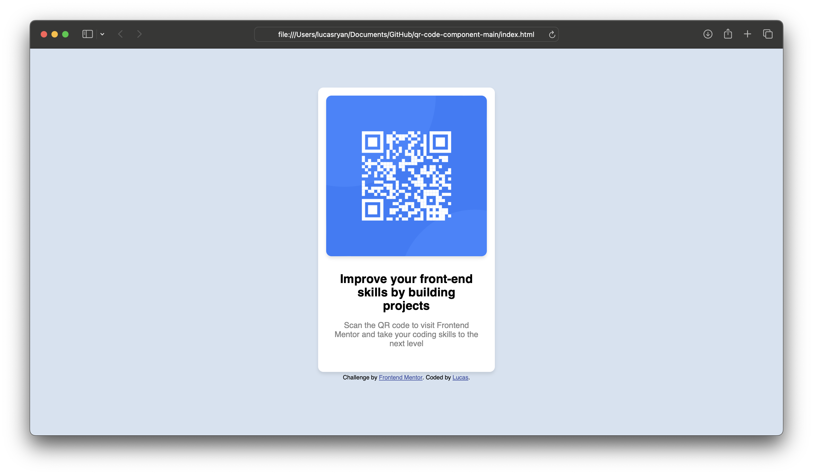

# Frontend Mentor - QR code component solution

This is a solution to the [QR code component challenge on Frontend Mentor](https://www.frontendmentor.io/challenges/qr-code-component-iux_sIO_H). Frontend Mentor challenges help you improve your coding skills by building realistic projects. 

## Table of contents

- [Overview](#overview)
  - [Screenshot](#screenshot)
  - [Links](#links)
- [My process](#my-process)
  - [Built with](#built-with)
  - [What I learned](#what-i-learned)
  - [Continued development](#continued-development)


**Note: Delete this note and update the table of contents based on what sections you keep.**

## Overview

### Screenshot



### Links

- Solution URL: [Add solution URL here](https://luc0ryan.github.io/qr-code-component-main/)

## My process

### Built with

- Semantic HTML5 markup
- CSS custom properties
- Flexbox
- Mobile-first workflow
- [Google Fonts](https://fonts.google.com)

### What I learned

Learned how to expertly apply flexbox, and what are the common limitations and methods of using a vertical flexbox for example, how common max-width is used. In this case, setting up a max width around the image was the best play although in the future, more responsive-proof methods may be required as we try to scale the image.
```html
  <div class="container">
  
  <div class ="text">
  <h1>Improve your front-end skills by building projects</h1>
  
  <p>Scan the QR code to visit Frontend Mentor and take your coding skills to the next level</p>
</div>
```

### Continued development

I'd like to apply more scaling types of images and such so that the flex box can be as responsive as possible with the content while keeping the desired shape.


